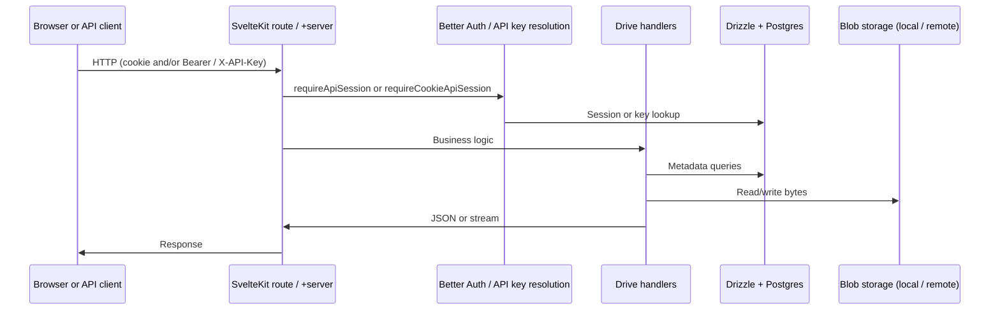

# Architecture

At a high level, a request flows from the edge through SvelteKit routing, optional auth, and into small server modules that talk to Postgres and storage backends.

## Auth split

- **`requireApiSession`** — used by **drive** JSON/binary APIs. Accepts a normal session cookie **or** a developer API key in `Authorization` / `X-API-Key`.
- **`requireCookieApiSession`** — used for **developer settings** (mode toggle, key CRUD). Keys cannot manage themselves over the key-only path.

## Storage abstraction

File rows in Postgres record names, hierarchy, labels, trash state, and a **storage provider** id. Bytes are read and written through server helpers that know how to open a path or remote object for `local` vs `tigris` (or future providers).

## Public links

A separate table stores revocable **tokens** tied to file ids. Anonymous users hit **`/api/public/*`** and the root **`/[token]`** page without any session.

## Docs site

The **`/onboarding/docs`** tree is a static route under onboarding with a shared layout (drawer sidebar, breadcrumbs, prose). It is public and safe to prerender because it does not read private data.
